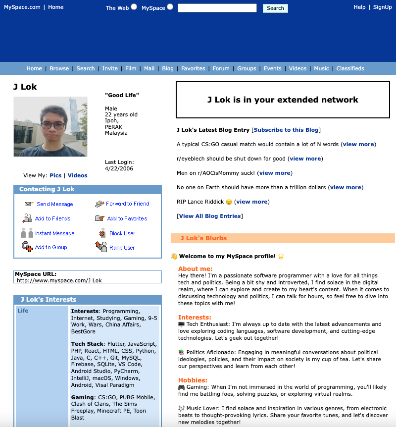

# J'Lok Myspace Webpage

This is a Myspace webpage that I created using HTML and CSS. It's a throwback to the good old days of social networking! 🎉

This project was forked from [wittenbrock/toms-myspace-page](https://github.com/wittenbrock/toms-myspace-page). Credits to the original creator for their amazing work!

## Preview

## Features

- **Profile Section:** A personalized profile section where you can add your own information, including a profile picture, bio, and contact details.
- **Top Friends:** Display your top friends with their profile pictures and names.
- **About Me:** Share more about yourself, including your interests, favorite movies, and music.
- **Guestbook:** Let your friends leave comments and messages in your guestbook.

## Getting Started

To use and modify this Myspace webpage, follow these steps:

1. Clone this repository to your local machine.
2. Open the `index.html` file in your preferred web browser.
3. Customize the webpage by modifying the HTML and CSS files.
4. Add your own images. Make sure to update the `alt` attribute in the HTML file.
5. Personalize the content in the HTML file to reflect your own profile information, top friends, about me section, photo gallery, and guestbook.
6. Save your changes and refresh the webpage to see the updates in action.

## Dependencies

This project does not have any external dependencies. It uses pure HTML and CSS.

## License

The Myspace Webpage project is licensed under the [MIT License](LICENSE).
Feel free to use, modify, and distribute this code for your own projects.

## Acknowledgements

This project was forked from [wittenbrock/toms-myspace-page](https://github.com/wittenbrock/toms-myspace-page). Special thanks to the original creator for laying the foundation of this project.
